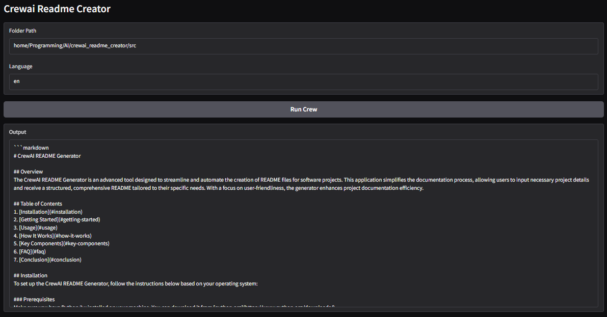

# README CrewAI Creator

## Overview
The README CrewAI Creator is a robust tool designed to aid users in analyzing files within a specified directory and creating a README file. It employs specialized agents to perform various tasks, including research, planning, writing, and reviewing README files, providing a structured approach to file analysis and documentation.




## Table of Contents
- [Features](#features)
- [Key Components](#key-components)
  - [Main Program](#main-program)
  - [Crew Definition](#crew-definition)
  - [Task Definitions](#task-definitions)
  - [Agent Configurations](#agent-configurations)
- [Setup Guide](#setup-guide)
  - [System Requirements](#system-requirements)
  - [Installation Instructions](#installation-instructions)
- [How to Use the CrewAI Readme Creator](#how-to-use-the-crewai-readme-creator)
  - [Running the Program](#running-the-program)
  - [Understanding the Output](#understanding-the-output)
- [Contribution](#contribution)
- [License](#license)
  
## Features
- Automated file analysis
- Structured README generation
- Task-specific agent configurations
- Customizable tool extensions

## Key Components

### Main Program
- `main.py`: Entry point for executing scripts for various functionalities, including running the crew and testing capabilities.

### Crew Definition
- `crew.py`: Defines `CrewaiReadmeCreator` that sets up agents and tasks involved in the analysis process.

### Task Definitions
- `tasks.yaml`: Contains clearly defined tasks for specialized analysis and documentation, including:
  - **Folder Analyzer Task**: Analyzes files in a specified folder.
  - **Research Task**: Researches content of identified files.
  - **README Planning**: Plans the README structure based on findings.
  - **README Writing**: Generates the README file.
  - **README Reviewing**: Ensures completeness and adherence to standards.

### Agent Configurations
- `agents.yaml`: Contains configurations for each agent’s role, goal, and function in the project, such as:
  - **Senior Data Researcher**: In-depth file research and reporting.
  - **README Planner**: Planning README structure.
  - **README Writer**: Crafts user-friendly documentation.
  - **README Reviewer**: Verifies documentation quality.

## Setup Guide

### System Requirements
- Python 3.12
- Required libraries: Please refer to the `requirements.txt` file in the repository.

### Installation Instructions
1. Clone the repository:  
   ```bash
   git clone https://github.com/username/crewai_readme_generator.git
   ```
2. Navigate to the project directory:  
   ```bash
   cd crewai_readme_generator
   ```
3. Activate the environment:  
   3.1 Conda:
      ```bash
      conda create -n crewai-readme-creator-env python=3.12
      conda activate crewai-readme-creator-env
      ```
    3.2 Pip:  
      ```bash
      python -m venv crewai-readme-creator-env
      source crewai-readme-creator-env/bin/activate
      ```
4. Install dependencies:  
   ```bash
   pip install -r requirements.txt
   ```
5. Install the crew:  
   ```bash
   crew install
   ```
6. Setup the llm model:
   - OpenAI API Key in the .env file:  
     ```bash
     OPENAI_API_KEY='your_openai_api_key'
     ```
        - Check the model in `agents.yaml` file:  
            ```yaml
            model: 'openai/gpt-4o'
            ```
   - Groq API Key in the .env file:  
     ```bash
     GROQ_API_KEY='your_groq_api_key'
     ```
        - Change model in `agents.yaml` file:  
            ```yaml
            model: 'groq/llama-3.1-70b-versatile'
            ```


## How to Use the CrewAI Readme Creator

### Running the Program
- Set the folder path in the `main.py` file:  
    ```python
    FOLDER = 'your_folder_path'
    ```
- Set the language in the `main.py` file:  
   ```python
   LANGUAGE = 'your_language'
   ```
- Run the crew:  
   ```bash
   crewai run
   ```

### Running the Web App
- Run the web app:  
   ```bash
   python src/app.py
   ```

### Understanding the Output
- The output will provide an analysis of files in the specified directory and generate a README file structured according to research findings.

## Contribution
For those interested in contributing to the CrewAI Readme Creator, please follow the guidelines for submitting pull requests and reporting issues in the repository.

## License
This project is licensed under the MIT License. See the LICENSE file for details.
